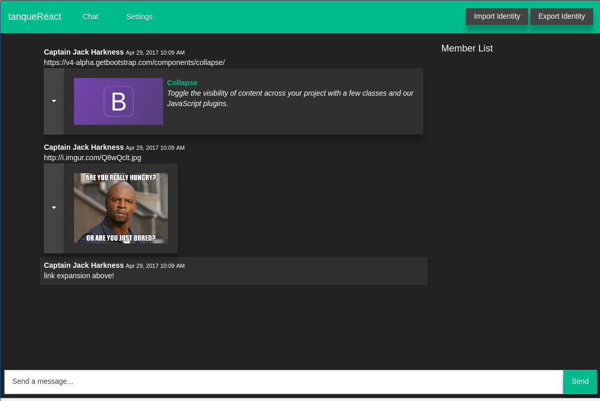

# tanqueRéact
[](https://travis-ci.org/NullVoxPopuli/tanqueReact)
[](https://codeclimate.com/github/NullVoxPopuli/tanqueReact)

tanqueRéact is a p2p* encrypted chat client. Only the intended recipient(s) may read what you send (messages, images, etc)




<span style='font-size: 9px; line-height: 10px;'>\* this isn't actually p2p, as there are servers involved, but it's designed to not be reliant on one server, but to utilize redundancy. The server, or 'relays', are [open sourced here](https://github.com/NullVoxPopuli/mesh-relay).
The servers only relay messages, and can't decrypt anything.
</span>

## [Live Site](https://nullvoxpopuli.github.io/tanqueReact/)
The only storage is local storage, so your information is never shared with anyone.

### Initial Setup

```bash
docker-compose build
```

### Running

```bash
./run
```

## Linting

Since all the packages are managed in docker's environment, you'll need to install the linter packages on your system.

```bash
# lazy install everything technique - also helpful for IDE's ESLint
yarn install --pure-lockfile
```

node_modules is already in the gitignore.

note that node_modules is not required to exist, as the app makes use of the in-docker node_modules.

The host node version should match the docker version -- so nvm is recommended.

## Testing

```bash
./run npm run test:watch # or just test (for C.I.)
```

## Dependencies

[Yarn](https://yarnpkg.com/en/), rather than npm.
 - Caching for faster dev.

```bash
./run yarn add dep-name --dev
docker-compose build
```

### Installing
```bash
./run yarn install --flat
```
forces only having one copy of a dependency.

### Check Info (e.g.: looking for bins)
```bash
./run yarn info webpack
```
